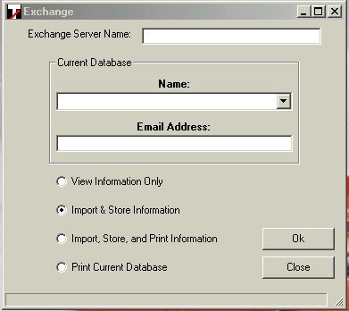



## Anonymous Exchange 5\.5 or higher

### Description

You must have Access 2000 installed in order to print.

Other than that you should be fine.

This will anonymously query an exchange 5.5 or higher exchange server and retrieve

The names and email addresses and place them into an access database.

This code has many useful examples. Please vote, and check out my other code :-)
 
### More Info
 

             |
---                |---
**Submitted On**   |2000-11-08 16:40:44
**By**             |[Shane Croft](https://github.com/Planet-Source-Code/PSCIndex/blob/master/ByAuthor/shane-croft.md)
**Level**          |Advanced
**User Rating**    |4.2 (38 globes from 9 users)
**Compatibility**  |VB 6\.0
**Category**       |[Complete Applications](https://github.com/Planet-Source-Code/PSCIndex/blob/master/ByCategory/complete-applications__1-27.md)
**World**          |[Visual Basic](https://github.com/Planet-Source-Code/PSCIndex/blob/master/ByWorld/visual-basic.md)
**Archive File**   |[CODE\_UPLOAD114911182000\.zip](https://github.com/Planet-Source-Code/shane-croft-anonymous-exchange-5-5-or-higher__1-12621/archive/master.zip)

